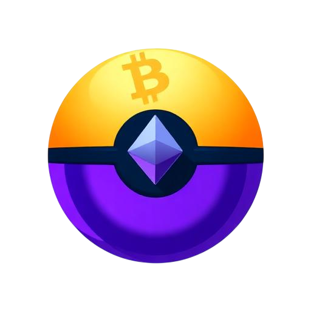

# ℙ𝕠𝕜𝕖𝕄𝕖𝕥𝕒𝕏

**All-in-one multi-chain crypto wallet with on-chain smart contracts on Polygon**

[Live App](https://pokemetax.io) · [How It Works](https://pokemetax.io/how-it-works) · [Privacy Policy](https://pokemetax.xyz/privacy)

---

> **The most secure self-custody wallet for scheduled payments** — no smart wallets, no approvals, no keepers. *Create, Deposit, wait, claim.*

---

### 📅 Unique Scheduled Payments

We are the only self-custody wallet in the world that enables scheduled payments without smart wallets, without prior approvals, and without external keepers. You deposit, the recipient claims when the time comes. That simple.

### 🔐 Secure Backup with Total Availability

Your wallet encrypted with military-grade security (AES-256-GCM) travels with you. Access it from anywhere in the world, at any time (24/7), just by accessing your email. No servers, no databases, no intermediaries.

### 🌐 Two Usage Modes

| | Mode | Description |
|---|------|-------------|
| 🌍 | **Web Mode** | Access from any browser worldwide. Compatible with Chrome, Firefox, Brave, Safari, Edge and more. No installation required. |
| 🧩 | **Extension Mode** | Extension for Chromium browsers in sidebar format. Integrated Web3 navigation assistance without leaving your favorite dApps. |

### 🔒 Maximum Security: No Databases

We proudly do **NOT** use databases to store your information. Your private keys and seed phrases **NEVER** leave your device. Everything is encrypted locally with AES-256-GCM. You are the sole custodian of your assets.

---

## Overview

PokéMetaX is a self-custodial, browser-based crypto wallet supporting **Bitcoin, Ethereum, Solana, and all major EVM chains**. Built entirely client-side with no server storing your keys — encrypted wallets live on your device only.

---

## Features

### 🔐 Wallet Management
- Create or import wallets via **seed phrase**, **private key**, or **encrypted `.txt` file**
- AES-256-GCM encryption (PBKDF2, 100K iterations) for all stored wallet data
- Multi-account support with aliases, pinning, and balance sorting
- Global lock / master password system
- Export wallet as encrypted `.txt` backup file with custom alias
- Cloud backup to IPFS (encrypted before upload)

### 🌐 Multi-Chain Support
| Network | Type | Symbol |
|---------|------|--------|
| Ethereum | EVM | ETH |
| Polygon | EVM | POL |
| Arbitrum | EVM | ETH |
| Optimism | EVM | ETH |
| Base | EVM | ETH |
| BNB Chain | EVM | BNB |
| Linea | EVM | ETH |
| Bitcoin | UTXO | BTC |
| Solana | SVM | SOL |
| Sepolia | Testnet | ETH |

### 💰 Real-Time Balances
- Live balance queries via public RPCs (no API key required)
- Prices via CoinGecko in your **local FIAT currency** (based on selected language)
- Multi-network EVM balance aggregation
- 24h price change indicators

### 🔄 On-Chain Smart Contract (Polygon)
| Contract | Address | Description |
|----------|---------|-------------|
| `ClaimableTransfer` | [`0x2dcaCb8064186c6d40fE0E6E879D676Eb032C06A`](https://polygonscan.com/address/0x2dcaCb8064186c6d40fE0E6E879D676Eb032C06A) | Schedule one-time or periodic transfers with recipient-side claim pattern |

### 🔗 WalletConnect
- Connect to any dApp supporting WalletConnect v2
- Sign transactions and personal messages from within the wallet
- Multi-chain session support

### 🌍 Internationalization
| Language | Currency |
|----------|----------|
| English | USD ($) |
| Español | EUR (€) |
| 中文 | CNY (¥) |
| हिन्दी | INR (₹) |
| Русский | RUB (₽) |
| العربية | AED (د.إ) |

---

---

## Security

- ✅ All private keys are encrypted with AES-256-GCM **before** being stored locally
- ✅ PBKDF2 key derivation with 100,000 iterations
- ✅ Master password never leaves the device
- ✅ No telemetry, no server-side key storage
- ✅ Smart contracts include re-entrancy protection, access control, and emergency withdraw
- ✅ WalletConnect sessions are scoped per dApp with explicit approval

---

## License

MIT © PokéMetaX
Treasure Public Address: [`0x2922602753C2bBf95C23944b0EbDc320e94c2AF9`](https://polygonscan.com/address/0x2922602753C2bBf95C23944b0EbDc320e94c2AF9)
contact@pokemetax.io

---

  Built with ❤️ on Polygon · Non-custodial Wallet · Your ePassword Your Cryptos

